Container image for Bash Language Server - A language server for Bash

## Usage

### Bash language server

```shell
docker run --rm -it ghcr.io/r-xs-fi/bash-language-server 
```

## Supported platforms


| OS    | Architecture  | Supported | Example hardware |
|-------|---------------|-----------|-------------|
| Linux | amd64 | ✅       | Regular PCs (also known as x64-64) |
| Linux | arm64 | ✅       | Raspberry Pi with 64-bit OS, other single-board computers, Apple M1 etc. |
| Linux | arm/v7 | ❌ (Some deps like shellcheck not available for this platform)       | Raspberry Pi with 32-bit OS, older phones |
| Linux | riscv64 | ❌ (Some deps like shellcheck not available for this platform)       | More exotic hardware |

## How does this software get to me?

```mermaid
flowchart TD
    subgraph "Origin"
        sourcerepo["Original source repo"]
        author_builds["Author builds the NPM package"]
    end
    subgraph "NPM registry"
        NPM_package[Package: bash-language-server 🔗]

        click NPM_package "https://www.npmjs.com/package/bash-language-server"
    end
    subgraph "Packaging build"
        rxsfi_build["r.xs.fi build (GitHub Actions)"]
    end
    subgraph "Container Registry"
        r_xs_fi_package_registry[ghcr.io/r-xs-fi/bash-language-server 🔗]

        click r_xs_fi_package_registry "https://ghcr.io/r-xs-fi/bash-language-server"
    end
    subgraph "user"
        docker_run[$ docker run ...]
    end
    sourcerepo -- used by --> author_builds -- upload --> NPM_package
    NPM_package -- download --> rxsfi_build
    rxsfi_build -- push --> r_xs_fi_package_registry
    r_xs_fi_package_registry -- pull --> docker_run[$ docker run ...]

```


